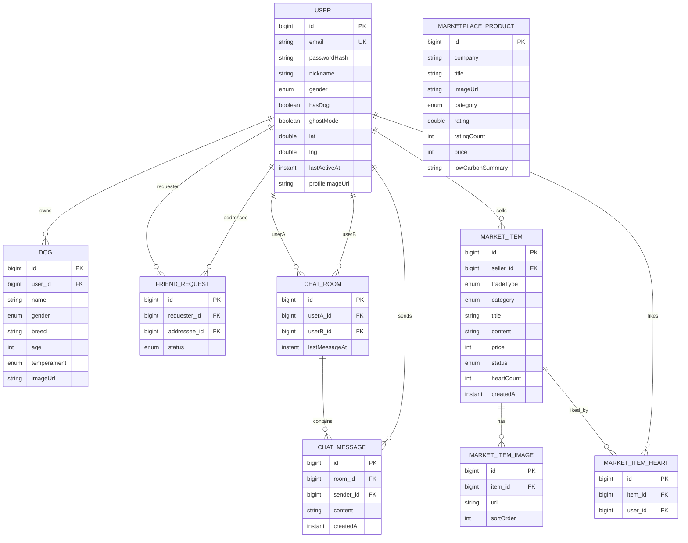

# WalkMate — Domain Model / 엔티티 / ERD

> JPA 엔티티/관계와 핵심 enum을 정의한다. 본문 한국어, 식별자는 영어.
> DB는 PostgreSQL(RDS). 근처 조회는 Haversine 쿼리(PostGIS 미사용). 관련:
> [domain 요구사항(PRD)](./PRD.md), [api-spec](./api-spec.md).

## 0. 공통 규칙
- PK: `id BIGINT` (auto-increment / identity).
- 공통 감사 필드: `created_at`, `updated_at` (`@CreatedDate`/`@LastModifiedDate`, JPA Auditing).
- 시각: `Instant`/`timestamptz` 권장(UTC 저장). 좌표: `lat`,`lng`는 `double`.
- 금액: `price`는 `INTEGER`(원 단위) — MVP 단순화.
- 삭제: MVP는 hard delete 또는 `status` 플래그. 별도 soft-delete 컬럼은 도입하지 않음.
- **Entity ↔ DTO 분리**: 엔티티는 영속 계층 전용, API 입출력은 DTO 사용(컨벤션은 CLAUDE.md).

---

## 1. Enum 정의

| Enum | 값 | 비고 |
| --- | --- | --- |
| `Gender` | `MALE`, `FEMALE`, `UNKNOWN` | 사용자/강아지 공용 |
| `DogTemperament` | `ACTIVE`, `CALM`, `FRIENDLY`, `SHY`, `INDEPENDENT`, `ETC` | 성향(제안값, 조정 가능) |
| `FriendRequestStatus` | `PENDING`, `ACCEPTED`, `REJECTED` | 친구 요청 상태 |
| `TradeType` | `BUY`(사요), `SELL`(팔아요) | 중고거래 글 유형 |
| `MarketCategory` | `FOOD`(먹거리), `TOY`(장난감), `DAILY`(생활용품), `CLOTHING`(의류), `ETC`(기타) | 중고거래 카테고리. 필터 '전체'는 미저장 |
| `MarketItemStatus` | `ON_SALE`(판매중), `SOLD`(거래완료) | 거래완료 여부 |
| `MarketplaceCategory` | `FOOD`(먹거리), `DAILY`(생활용품), `ETC`(기타) | 저탄소 마켓 카테고리. 필터 '전체'는 미저장 |

> DB 저장은 `@Enumerated(EnumType.STRING)` (가독성·확장성).

---

## 2. 엔티티

### 2.1 `User`
| 필드 | 타입 | 설명 |
| --- | --- | --- |
| `id` | Long (PK) | |
| `email` | String, unique | 로그인 ID |
| `passwordHash` | String | BCrypt 해시 (평문 저장 금지) |
| `nickname` | String | 온보딩 입력 |
| `gender` | `Gender` | |
| `hasDog` | boolean | 강아지와 함께 나오는지 |
| `ghostMode` | boolean (default false) | ON이면 위치 비노출 |
| `lat`, `lng` | double, nullable | 최근 위치 |
| `lastActiveAt` | Instant, nullable | 위치 PATCH/활동 시 갱신. 24h·online 판정 기준 |
| `profileImageUrl` | String, nullable | S3 URL |
| `createdAt`,`updatedAt` | Instant | |

관계: `User 1 — 0..N Dog` (MVP는 0..1 운용). 친구/채팅/마켓의 작성자로 참조됨.

### 2.2 `Dog`
| 필드 | 타입 | 설명 |
| --- | --- | --- |
| `id` | Long (PK) | |
| `user` | ManyToOne → User | 소유자 (설계상 1:N, MVP 1마리) |
| `name` | String | 강아지명 |
| `gender` | `Gender` | |
| `breed` | String | 품종 |
| `age` | Integer, nullable | 나이(선택) |
| `temperament` | `DogTemperament` | 성향 |
| `imageUrl` | String, nullable | S3 URL (근처목록 프로필 이미지 후보) |

### 2.3 `FriendRequest` (친구 관계)
| 필드 | 타입 | 설명 |
| --- | --- | --- |
| `id` | Long (PK) | |
| `requester` | ManyToOne → User | 보낸 사람 |
| `addressee` | ManyToOne → User | 받은 사람 |
| `status` | `FriendRequestStatus` | `PENDING`→`ACCEPTED`/`REJECTED` |
| `createdAt`,`updatedAt` | Instant | |

- `ACCEPTED` 상태인 행이 곧 친구 관계를 표현(별도 Friendship 테이블 없이 단순화).
- 친구 목록 = 본인이 requester 또는 addressee 이고 `status=ACCEPTED` 인 상대 집합.
- unique 제약: `(requester_id, addressee_id)` 중복 요청 방지(양방향 중복은 서비스 검증).

### 2.4 `ChatRoom`
| 필드 | 타입 | 설명 |
| --- | --- | --- |
| `id` | Long (PK) | |
| `userA` | ManyToOne → User | 참여자(정렬: 작은 id) |
| `userB` | ManyToOne → User | 참여자(정렬: 큰 id) |
| `lastMessageAt` | Instant, nullable | 방 목록 정렬용 |
| `createdAt` | Instant | |

- unique 제약: `(userA_id, userB_id)` — `userA_id < userB_id`로 정규화해 1:1 방 중복 방지(idempotent 생성).

### 2.5 `ChatMessage`
| 필드 | 타입 | 설명 |
| --- | --- | --- |
| `id` | Long (PK) | |
| `room` | ManyToOne → ChatRoom | |
| `sender` | ManyToOne → User | |
| `content` | String (text) | 메시지 본문 |
| `createdAt` | Instant | 송신 시각 (`?after=` 폴링 기준) |

### 2.6 `MarketItem` (중고거래 글)
| 필드 | 타입 | 설명 |
| --- | --- | --- |
| `id` | Long (PK) | |
| `seller` | ManyToOne → User | 작성자 |
| `tradeType` | `TradeType` | BUY/SELL |
| `category` | `MarketCategory` | |
| `title` | String | 제목 |
| `content` | String (text) | 상세 내용 |
| `price` | Integer, nullable | SELL만 사용(BUY는 null) |
| `status` | `MarketItemStatus` | 기본 `ON_SALE` |
| `heartCount` | int (default 0) | 하트 집계 캐시(=`MarketItemHeart` count) |
| `createdAt`,`updatedAt` | Instant | 업로드 일자 |

관계: `MarketItem 1 — N MarketItemImage`, `1 — N MarketItemHeart`.

### 2.7 `MarketItemImage`
| 필드 | 타입 | 설명 |
| --- | --- | --- |
| `id` | Long (PK) | |
| `item` | ManyToOne → MarketItem | |
| `url` | String | S3 URL |
| `sortOrder` | int | 정렬(0=대표 이미지) |

### 2.8 `MarketItemHeart` (좋아요)
| 필드 | 타입 | 설명 |
| --- | --- | --- |
| `id` | Long (PK) | |
| `item` | ManyToOne → MarketItem | |
| `user` | ManyToOne → User | |
| `createdAt` | Instant | |

- unique 제약: `(item_id, user_id)` — 사용자당 1회 토글. 토글 시 `MarketItem.heartCount` 동기화.

### 2.9 `MarketplaceProduct` (저탄소 마켓 상품)
| 필드 | 타입 | 설명 |
| --- | --- | --- |
| `id` | Long (PK) | |
| `company` | String | 회사 |
| `title` | String | 제목 |
| `imageUrl` | String | S3 URL |
| `category` | `MarketplaceCategory` | |
| `rating` | double | 별점(시드값) |
| `ratingCount` | int | 별점 개수(시드값) |
| `price` | Integer | 가격 |
| `lowCarbonSummary` | String, nullable | **LLM-2(a) 시드 1회 생성·캐싱** ("왜 저탄소인지") |
| `createdAt` | Instant | |

- 사용자 등록 없음(운영자/시드). 별점/리뷰 작성 기능 없음.

---

## 3. 관계 요약
- `User (1) — (0..N) Dog` : MVP는 0..1로 운용.
- `User (1) — (N) FriendRequest` (requester / addressee 양방향 참조). `ACCEPTED` = 친구.
- `User (N) — (N) User` via `ChatRoom` (1:1 방), `ChatRoom (1) — (N) ChatMessage`.
- `User (1) — (N) MarketItem` (seller). `MarketItem (1) — (N) MarketItemImage`, `(1) — (N) MarketItemHeart`.
- `User (1) — (N) MarketItemHeart` (좋아요 누른 사람).
- `MarketplaceProduct` 는 독립(사용자 미참조).

---

## 4. ERD (Mermaid)

> `MARKETPLACE_PRODUCT`는 다른 엔티티와 관계가 없어 다이어그램에서 독립 노드로 둔다.

---

## 5. 인덱스 / 쿼리 힌트
- `User(lat, lng)` + `lastActiveAt`: 근처 조회는 좌표 bounding-box 1차 필터 후 Haversine 정렬 권장.
- `ChatMessage(room_id, created_at)`: 방별 메시지 페이징/`?after=` 폴링.
- `MarketItem(trade_type, category, status, created_at)`: 목록 필터.
- `MarketItemHeart(item_id, user_id)` unique, `ChatRoom(userA_id, userB_id)` unique,
  `FriendRequest(requester_id, addressee_id)` unique.
